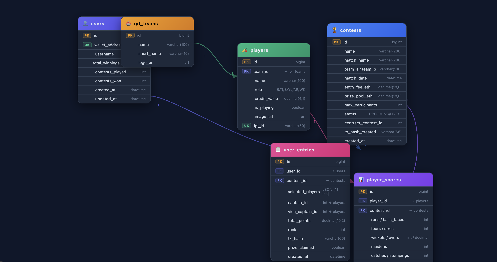

## 1. Project Overview

### What is Pitchain?
Pitchain is a decentralised Web3 fantasy cricket platform built for IPL. Users connect their **MetaMask browser wallet**, pay a **Base Sepolia testnet ETH** entry fee, select 11 players from both IPL teams, earn fantasy points based on real match performance, and winners automatically receive prize tokens via smart contract — no middleman, no manipulation.

### Problem
Traditional fantasy apps (Dream11, MPL) are centralised. Prize distribution is opaque, payouts can be delayed, and users have to trust the platform blindly. There is no on-chain proof of fairness.

### Solution
All entry fees are held by a Solidity smart contract deployed on **Base Sepolia testnet**. Prize distribution is triggered by an admin after the match and executed automatically on-chain. Every transaction is publicly verifiable on **Base Sepolia Explorer**. The admin wallet earns a platform fee automatically from every contest — deducted transparently by the smart contract before prizes are sent.

## Database Schema (ERD)

